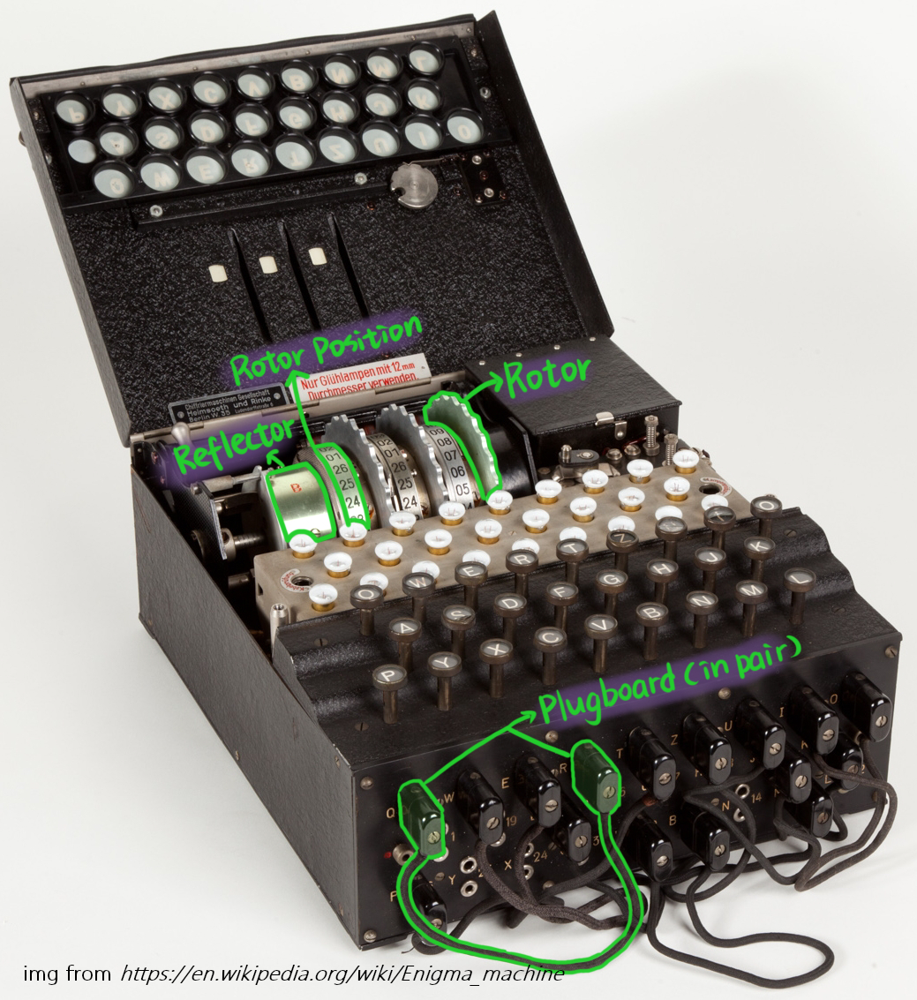

# Enigma Machine Simulator

#### Video Demo: https://www.youtube.com/watch?v=REJIusxvDFU

------

#### Description:

This program simulates the "Enigma Machine," an encryption device used by the German military during World War II. To understand how the machine works, please watch this video: [link](https://www.youtube.com/watch?v=ybkkiGtJmkM&t=551s). The Enigma Simulator supports both encryption and decryption of characters. To get started, you need to configure several machine parameters, including rotor positions and the plugboard. Each time you press a character, the internal rotor rotates, altering the letter mapping. To decrypt a message, you need to use the exact same configuration that was used for encryption.



------

#### How to use

Upon running the program, an Enigma Machine instance is automatically created with default settings: rotor positions are set to 0,0,0, and the plugboard has no letter swaps configured. The initial display after starting the program will look like this:

```
--------Welcome to Enigma Simulator------------
Current Rotors Position = [0, 0, 0]
-----------------------------------------------
1: Set plugboard
2: Set rotors
3: Encode/decode letters
4: Swap rotors
5: Display machine's info
6: Exit
Choice: 
```

**Options:**

- **Set plugboard**: Swap pairs of letters before and after they pass through the rotors. For example, if 'A' and 'B' are swapped on the plugboard, any occurrence of 'A' in the input will be substituted with 'B' and vice versa before the signal enters the rotor system.

- **Set rotors**: Configure the positions of the rotors. The default positions for the three rotors are 0,0,0. Each rotor position ranges from 0 to 25, and each turn changes the letter mapping.

- **Encode/decode letters**: Input the letters you wish to encode or decode.

- **Swap rotors**: Change the order of the three rotors. Different rotor orders will alter the letter mapping.

- **Display machine's info**: Show the current configuration of the machine, including the plugboard settings, rotor positions, rotors table, and reflector table.

  ------

  

#### Example

Here’s a fluent English translation of your example:

Under the default settings (rotor positions set to 0,0,0), if you encode the word "hello," the output will be "ZTBGY." Each time you input a letter, the rotor position advances, so after encoding, the rotor positions are [5, 0, 0].

```
--------Welcome to Enigma Simulator------------
Current Rotors Position = [0, 0, 0]
-----------------------------------------------
1: Set plugboard
2: Set rotors
3: Encode/decode letters
4: Swap rotors
5: Display machine's info
6: Exit
Choice: 3
Please enter letters that you want to encode: hello
ZTBGY
--------Welcome to Enigma Simulator------------
Current Rotors Position = [5, 0, 0]
-----------------------------------------------
```

If you then encode the word "hello" again, you'll find the result is "RYVNI," which is different from the previous output. This occurs because the mapping changes with each letter typed, and after the second encoding, the rotor positions are [10, 0, 0]:

```
RYVNI
--------Welcome to Enigma Simulator------------
Current Rotors Position = [5, 0, 0]
-----------------------------------------------
1: Set plugboard
2: Set rotors
3: Encode/decode letters
4: Swap rotors
5: Display machine's info
6: Exit
Choice: 3
Please enter letters that you want to encode: hello
RYVNI
--------Welcome to Enigma Simulator------------
Current Rotors Position = [10, 0, 0]
```

To decrypt the first encoded message "ZTBGY," you need to set the rotor positions back to the exact configuration used before the first encoding, which is 0,0,0. Similarly, to decrypt the second encoded message "RYVNI," set the rotor positions to the settings used before the second encoding: 5,0,0.

```
Choice: 2
Rotors Setting: Please enter the 3 rotors' positions in format x,y,z (e.g., 0,0,0): 0,0,0
--------Welcome to Enigma Simulator------------
Current Rotors Position = [0, 0, 0]
-----------------------------------------------
1: Set plugboard
2: Set rotors
3: Encode/decode letters
4: Swap rotors
5: Display machine's info
6: Exit
Choice: 3
Please enter letters that you want to encode: ZTBGY
HELLO
```

By configuring the parameters (plugboard, rotor positions, and rotor order) to match those used before encryption, you can successfully decrypt the ciphertext! This is the power of the Enigma Machine: without knowing the exact settings used for encryption, even with the machine in hand, decryption is nearly impossible.
